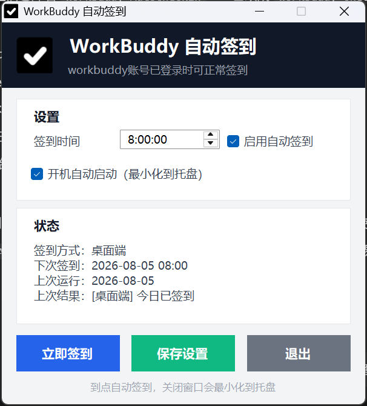

# WorkBuddy 自动签到

一个 Windows 桌面小工具：每天定时自动打开 WorkBuddy 客户端并领取签到积分。

原理是截屏 + Windows 自带 OCR 识别界面文字，再模拟鼠标点击，**不需要安装任何第三方库**。


> ⚠️ 自动签到属于个人自动化操作，请确认符合 WorkBuddy 服务条款后使用。

## 功能

- 图形界面 + 系统托盘，可设置每天签到时间
- 桌面端签到：自动启动/最大化 WorkBuddy 客户端
- 开机自动启动（最小化到托盘）
- 签到结果托盘通知 + 本地日志
- 单文件 exe，签到引擎内置，首次运行自动释放

## 界面预览



## 快速开始

1. 从 [Releases](https://github.com/dinasourlab/workbuddy-checkin/releases) 下载 `WorkBuddy-AutoCheckin-App.exe`（或自行编译，见下文）；
2. 双击运行，设置签到时间，点「保存设置」；
3. 点窗口右上角 ✕ 最小化到托盘，到点自动签到。

### 使用说明

- **签到时间**：按“下一次触发”计算。例如晚上设置 08:00，会在次日 08:00 触发；当天已定时执行过后会自动顺延到第二天。
- 右键托盘图标选「退出」才是真正退出；应用退出后定时不再执行。
- 首次使用建议先用 `-DryRun` 试运行（只识别、不点击）。

## 命令行方式（可选）

不用图形界面时，可以直接运行签到引擎：

```powershell
powershell -ExecutionPolicy Bypass -File .\src\WorkBuddy-AutoCheckin.ps1

# 只识别不点击（测试）
powershell -ExecutionPolicy Bypass -File .\src\WorkBuddy-AutoCheckin.ps1 -DryRun
```

也可以注册 Windows 计划任务（默认每天 09:05）：

```powershell
powershell -ExecutionPolicy Bypass -File .\tools\install-task.ps1 -Time 09:05
```

## 从源码构建

环境要求：Windows 10/11、.NET Framework 4.x（系统自带）、PowerShell 5.1、简体中文 OCR 语言包。

```powershell
powershell -ExecutionPolicy Bypass -File .\build\build-native.ps1
```

编译产物输出到 `dist\WorkBuddy-AutoCheckin-App.exe`。需要重新生成黑白图标时可运行：

```powershell
powershell -ExecutionPolicy Bypass -File .\build\make-icon.ps1
```

## 目录结构

```
workbuddy-checkin/
├── src/       C# 主程序源码 + 签到引擎脚本
├── build/     编译脚本、图标生成脚本
├── assets/    图标资源
├── tools/     计划任务安装脚本
└── dist/      编译产物（exe）
```

## 杀毒软件误报

旧版脚本打包器容易被启发式误报。当前 exe 为原生 .NET WinForms 编译，一般不误报；如果被杀毒软件隔离，请在隔离区还原，并把 exe 所在目录加入信任区。

## 许可证

[MIT](LICENSE) © 2026 dinasourlab
